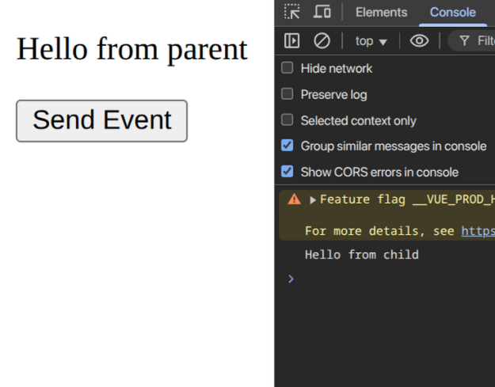

# PB_assignment_2-2
Vue 2에서 Vue 3로 리팩토링된 학습용 프로젝트입니다.
모든 컴포넌트를 Vue 2 Options API에서 Vue 3의 `<script setup>` 문법으로 리팩토링했습니다.

### 예시

#### Before
```javascript
export default {
  name: 'Component',
  data() {
    return {
      message: 'Hello'
    }
  },
  computed: {
    fullName() {
      return this.firstName + ' ' + this.lastName
    }
  },
  methods: {
    greet() {
      console.log(this.message)
    }
  }
}
```

#### After
```typescript
<script setup lang="ts">
import { ref, computed } from 'vue';

const message = ref('Hello');
const firstName = ref('John');
const lastName = ref('Doe');

const fullName = computed(() => firstName.value + ' ' + lastName.value);

const greet = () => {
  console.log(message.value);
};
</script>
```

## 변환 내역

모든 컴포넌트는 Vue3의 Composition API (`<script setup>`)로 작성되었습니다:

### Options API → Composition API 변환 매핑
- `data()` → `ref()` / `reactive()`
- `computed` → `computed()`
- `methods` → 일반 함수
- `mounted()` → `onMounted()`
- `beforeUnmount()` → `onBeforeUnmount()`
- `$emit` → `defineEmits()`
- `provide/inject` → `provide()` / `inject()` 함수

### 컴포넌트별 변경 요약

#### Example 1 - 기본 개념
- **E-01-instance.vue**: 기본 인스턴스 예제를 `<script setup>`으로 변환하고 `ref`를 이용해 초기 데이터를 선언했습니다.
- **E-02-reactive.vue**: `reactive` 객체를 활용해 복합 상태를 구성하고, Vue2 `data` 속성을 대체했습니다.
- **E-03-binding.vue**: 양방향/단방향 바인딩을 `ref`와 `computed` 조합으로 재구성했습니다.

#### Example 2 - 디렉티브
- **E-04-directives.vue**: 디렉티브 예제를 Composition API 함수와 템플릿 기준 문법으로 정리했습니다.

#### Example 3 - Props & Events
- **ParentComponent.vue** (example3): 부모 상태를 `ref`로 정의하고 자식에게 props와 이벤트를 전달하도록 업데이트했습니다.
- **ChildComponent.vue** (example3): `defineProps`와 `defineEmits`로 메시지 전달과 커스텀 이벤트 전송을 구현했습니다.

#### Example 4 - Provide/Inject
- **ParentComponent.vue** (example4): `provide`로 공유 데이터를 전달하도록 Composition API 기반으로 수정했습니다.
- **ChildComponent1.vue** (example4): `inject`를 사용해 부모의 제공 데이터를 수신하도록 구현했습니다.
- **ChildComponent2.vue** (example4): 다중 주입 데이터를 읽고 내부 상태로 활용하도록 구성했습니다.

#### Example 5 - API 비교
- **E-07-Options-API.vue**: Options API 예제를 Composition API와 나란히 비교할 수 있도록 `<script setup>` 구조로 정리했습니다.
- **E-08-composition-api.vue**: Composition API 패턴을 `ref`, `computed`, `watch` 등으로 정리해 Options API 대비 장점을 보여줍니다.
- **E-09-composition-API2.vue**: Composition API 확장 예제로 훅 분리와 재사용 가능 로직 작성법을 시연합니다.

#### Example 6 - Ref & Reactive
- **E-10-ref.vue**: 여러 `ref` 활용법과 DOM 참조 사용법을 Vue3 스타일로 변환했습니다.
- **E-11-reactive.vue**: `reactive` 상태와 `toRefs` 변환을 통해 반응형 객체를 관리합니다.
- **E-12-ref-component.vue**: `ref`를 활용한 자식 컴포넌트 참조 및 메서드 호출 패턴을 구현했습니다.

## 리팩토링 후 스크린샷

### Example 1 - E-01-instance.vue


### Example 1 - E-02-reactive.vue


### Example 1 - E-03-binding.vue


### Example 2 - E-04-directives.vue


### Example 3 - ParentComponent.vue


### Example 4 - ParentComponent.vue


### Example 5 - E-09-composition-API2.vue


### Example 6 - E-10-ref.vue


### Example 6 - E-11-reactive.vue


### Example 6 - E-12-ref-component.vue


## Project setup
```
npm install
```

### Compiles and hot-reloads for development
```
npm run serve
```

### Compiles and minifies for production
```
npm run build
```

### Lints and fixes files
```
npm run lint
```

### Customize configuration
See [Configuration Reference](https://cli.vuejs.org/config/).