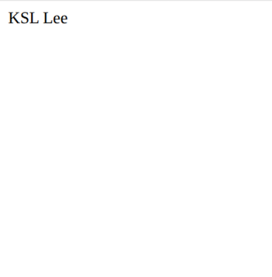
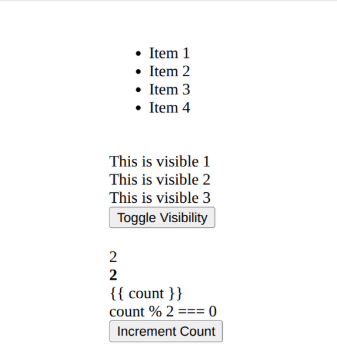
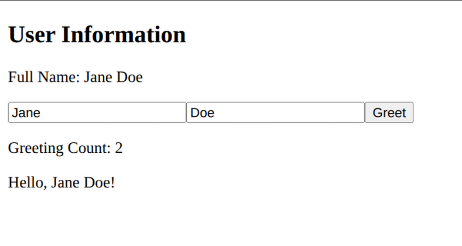
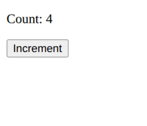
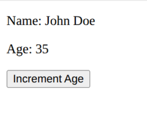
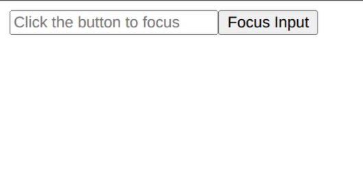

# PB_assignment_2-2
Vue 2에서 Vue 3로 리팩토링된 학습용 프로젝트입니다.
모든 컴포넌트를 Vue 2 Options API에서 Vue 3의 `<script setup>` 문법으로 리팩토링했습니다.

### 예시

#### Before
```javascript
export default {
  name: 'Component',
  data() {
    return {
      message: 'Hello'
    }
  },
  computed: {
    fullName() {
      return this.firstName + ' ' + this.lastName
    }
  },
  methods: {
    greet() {
      console.log(this.message)
    }
  }
}
```

#### After
```typescript
<script setup lang="ts">
import { ref, computed } from 'vue';

const message = ref('Hello');
const firstName = ref('John');
const lastName = ref('Doe');

const fullName = computed(() => firstName.value + ' ' + lastName.value);

const greet = () => {
  console.log(message.value);
};
</script>
```


## 리팩토링 후 스크린샷

### E-01-instance.vue


### E-02-reactive.vue


### E-03-binding.vue


### E-04-directives.vue


### ParentComponent.vue


### E-09-composition-API2.vue


### E-10-ref.vue


### E-11-reactive.vue


### E-12-ref-component.vue


## Project setup
```
npm install
```

### Compiles and hot-reloads for development
```
npm run serve
```

### Compiles and minifies for production
```
npm run build
```

### Lints and fixes files
```
npm run lint
```

### Customize configuration
See [Configuration Reference](https://cli.vuejs.org/config/).